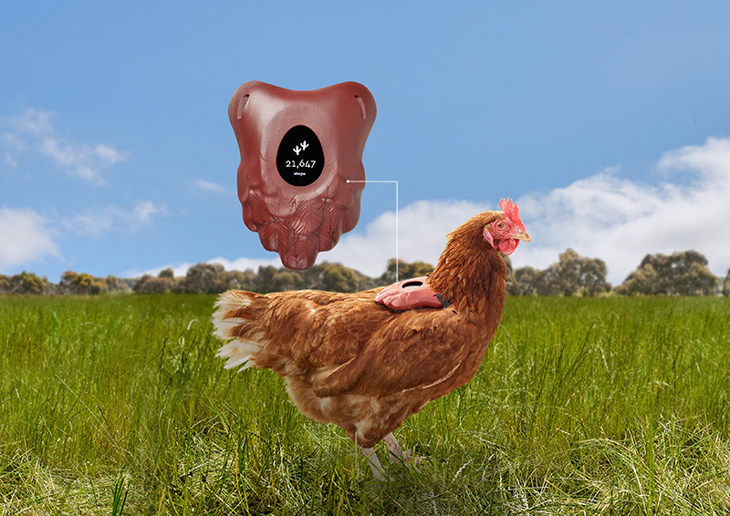
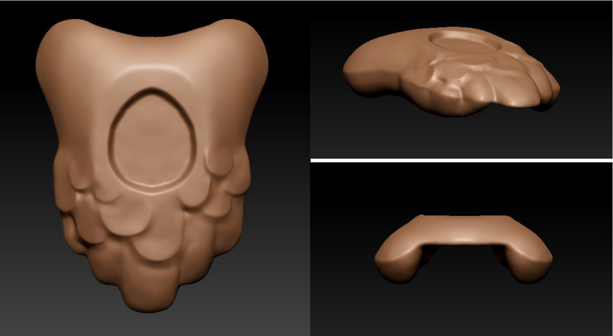

# 3D Printed Chicken Tracking Backpack

This device is the key component in measuring the movements of a chicken with a GPS tracking device.
To accurately track the movements of a chicken the core challenge is integrating the tracking device into a wearable that is not intrusive to the chicken.
These plans have been tested on free range chickens and provide minimal intrusion to the individual chicken, and crucially for these pack animals, minimal distraction to the flock.
With this key hurdle being overcome the plans can be altered to house any GPS based tracking device of your choosing.

In our usage of the backpack for FitChix we have integrated software into a tracking device to measure both the steps and distance travelled of each chicken.
However, in this public release we recommend measuring distance with your choice of fitness tracker. This will save valuable time, money and effort in integrating the software into the unit and still provide the user an accurate assessment of the distance a chicken travels over time.

### Notes, on finishing the product:

A 3D printed device will need smoothing with sand paper.
To naturally integrate the product to a chicken we strongly recommend painting the devices the with non-toxic paint. The paint colour must match the colouration of the type of chicken being tracked.
In using our device we attached 8mm wide black elastic straps to device that were looped under each of the chicken’s wings. These can then be tightened to fit snugly while still providing freedom of movement.

### Materials required:
- 3D printer.
- GPS based fitness tracker. 3D plans can be altered to house different devices.
- Black elastic straps for fixing the backpack to chickens.
- 600 Grit Sandpaper. For smoothing the 3D printed edges of the backpack.
- Non-toxic paint to paint the device.
- Android or iPhone for syncing and collection of data.
